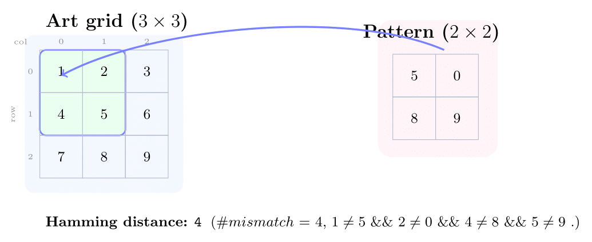
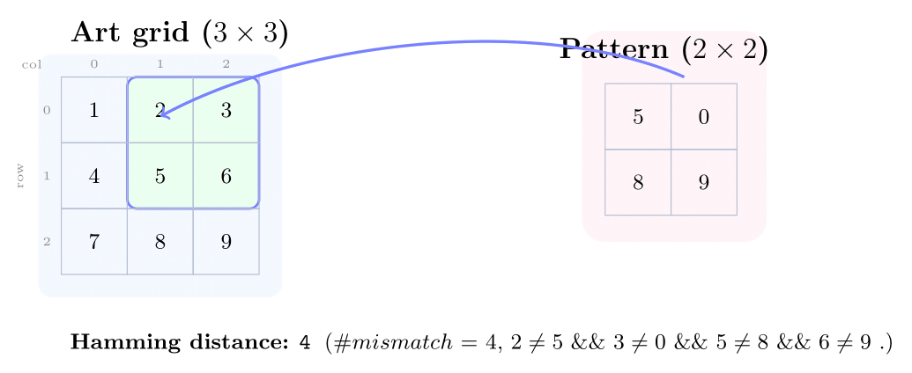
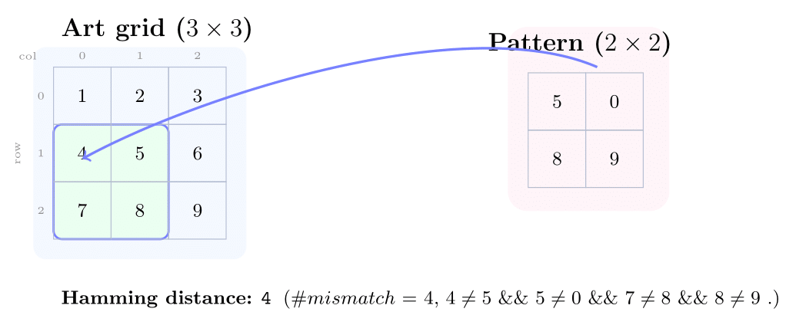
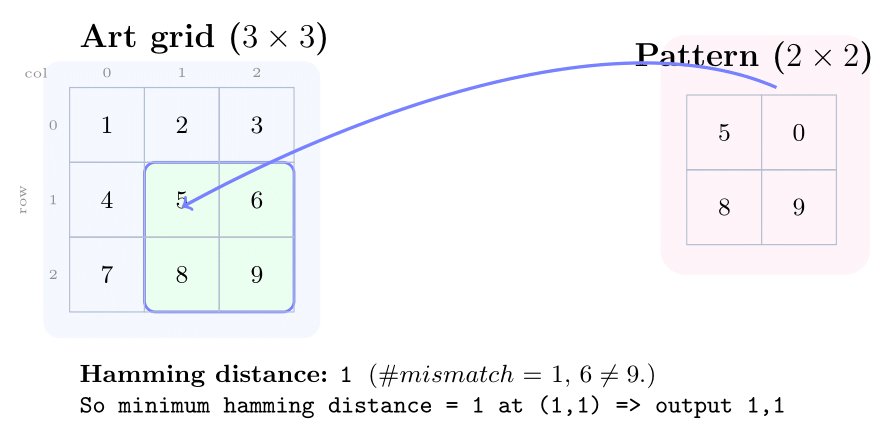

# Problem — Min-Hamming Placement
## Overview

You are given:

* a 2D integer grid `art_data` of size `art_height × art_width`, and
* a smaller 2D integer grid `pattern_data` of size `art_width × pattern_width`,
  both with signed integers.

Slide the pattern over every position where it fully fits inside the art. For each top-left position `(r, c)`, compute the **Hamming distance** between the `pattern_height × pattern_width` window of the art and the pattern:

> Hamming distance = # of indices `(i, j)` with `0 ≤ i < pattern_height`, `0 ≤ j < pattern_width` such that
> `art[r+i, c+j] != pattern[i, j]`.

Find `(r, c)` that **minimizes** this Hamming distance.

If multiple positions tie for the minimum, choose the one with the **smallest row-major linear index** `r * art_width + c`. For example, in a `5 × 5` grid, if both positions `(0, 3)` and `(3, 4)` yield the same minimum distance of `1`, the position `(0, 3)` should be returned because its row-major index `0 * 5 + 3 = 3` is smaller than `3 * 5 + 4 = 19`.

## Example

Art (3×3):

```
1 2 3
4 5 6
7 8 9
```

Pattern (2×2):

```
5 0
8 9
```

Hamming distances:
(0,0) -> 4, (0,1) -> 1, (1,0) -> 4, (1,1) -> 4 => **minimum = 1** at `(0,1)` => output `std::pair{0, 1}`.







## The Code

### What you may (and must) change

Only edit the body of:

```cpp
// src/base.cpp
std::string compute(
  std::vector<int>& art_data,
  int art_width,
  std::vector<int>& pattern_data,
  int pattern_width
);
```

All other files (I/O, harness, etc.) cannot be modified. Your job is to read the two flat arrays, treat them as **row-major** 2D grids, and return the best top-left coordinate as `std::pair{ row, col }`.

### Information about the `compute` function inside `src/base.cpp`

**Inputs**

* `art_data` — row-major linearized 2d grid of size `art_height × art_width`.
* `art_width` — number of columns in `art_data`.
* `pattern_data` — row-major linearized 2d grid of size `pattern_height × pattern_width`.
* `pattern_width` — number of columns in `pattern_data`.

(Inputs are guaranteed valid in the official tests; if you like you can assert divisibility.)

To help you understand how to access an element in a 2D row-major array using `(row, col)` indices, a helper function `at(std::vector<int>& data, int row, int col, int width)` has been provided in `src/base.cpp`. For example, you can access element `(2, 3)` in `art_data` by:

```cpp
int val = at(art_data, 2, 3, art_width);
```